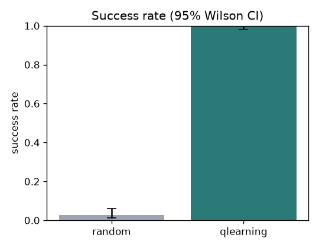
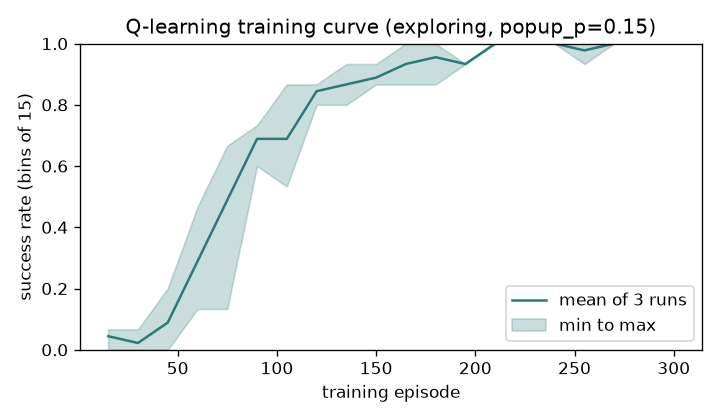
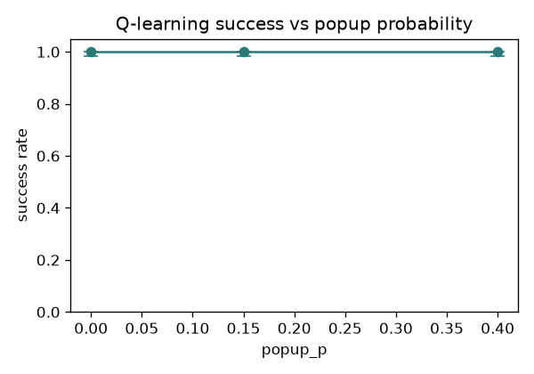
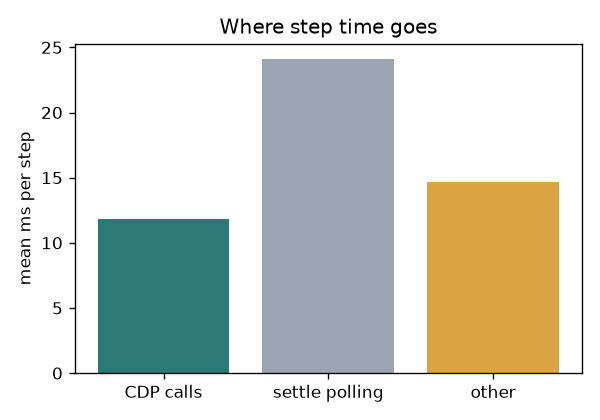
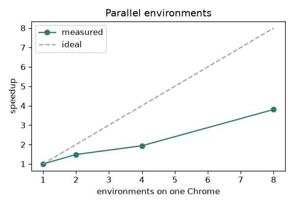

# MiniShop RL report

Computed by `scripts/analyze.py` from `logs\run.jsonl`: 14464 step lines, 1740 attempts (900 training, 840 evaluation).

## 1. Success rate of both agents

Evaluation attempts on unseen seeds, popup_p=0.15, delay_p=0.1. 95% Wilson confidence interval.

| agent | successes | attempts | success rate | 95% CI |
|---|---|---|---|---|
| random | 6 | 210 | 2.9% | 1.3% to 6.1% |
| qlearning | 210 | 210 | 100.0% | 98.2% to 100.0% |

The two confidence intervals do not overlap.



## 2. Training curve

3 independent training runs with different seeds, 300 episodes each, success averaged over bins of 15 episodes (training includes exploration).

Mean success in the first bin: 4.4%; in the last bin: 100.0% (last bin range over runs: 100.0% to 100.0%).



## 3. Popup probability sweep (Q-learning agent)

| popup_p | attempts | success rate | 95% CI | mean steps | attempts that saw a popup | step-limit failures |
|---|---|---|---|---|---|---|
| 0.0 | 210 | 100.0% | 98.2% to 100.0% | 4.32 | 0.0% | 0.0% |
| 0.15 | 210 | 100.0% | 98.2% to 100.0% | 4.59 | 28.6% | 0.0% |
| 0.4 | 210 | 100.0% | 98.2% to 100.0% | 5.07 | 63.8% | 0.0% |

**Explanation (computed).** From popup_p=0.0 to popup_p=0.4 the success rate did not change from 100.0% to 100.0%; the two confidence intervals overlap, so the difference is not clearly more than noise. Mean steps per attempt rose from 4.32 to 5.07, consistent with each popup costing at least one extra step to dismiss (attempts that saw a popup: 0.0% then 63.8%). A failure only happens when these extra steps push the attempt past the 20 step limit or when the agent acts wrongly while a popup is showing; step-limit failures went from 0.0% to 0.0%.



## 4. Top failure reasons of the Q-learning agent

238 failed attempts out of 900 training (no evaluation failures) attempts. Reason is assigned by code from the last log line of each attempt.

### step_limit_on_product_screen: 62 attempts (26.1% of failures)

```json
{"episode": 8, "run": 0, "seed": 1008, "goal": "red-lamp x3", "step": 20, "observation": {"buttons": [{"clickable": true, "data_id": "", "i": 7, "text": "-"}, {"clickable": true, "data_id": "", "i": 8, "text": "+"}, {"clickable": true, "data_id": "", "i": 9, "text": "Add to cart"}, {"clickable": true, "data_id": "", "i": 10, "text": "Back"}], "goal": "red-lamp x3", "popup_showing": false, "screen": "product"}, "action": "click(8)", "action_key": "+", "reward": -0.01, "done": false, "truncated": true, "time_ms": 33, "cdp_ms": 10, "settle_ms": 22, "popup_showing": false, "agent": "qlearning", "phase": "train", "popup_p": 0.15, "delay_p": 0.1, "info": {"cart_item": "red-lamp", "cart_qty": 2, "current_qty": 2, "delay_pending": false, "viewing_item": "blue-mug"}}
```
```json
{"episode": 10, "run": 0, "seed": 1010, "goal": "black-pen x1", "step": 20, "observation": {"buttons": [{"clickable": true, "data_id": "", "i": 7, "text": "-"}, {"clickable": true, "data_id": "", "i": 8, "text": "+"}, {"clickable": true, "data_id": "", "i": 9, "text": "Add to cart"}, {"clickable": true, "data_id": "", "i": 10, "text": "Back"}], "goal": "black-pen x1", "popup_showing": false, "screen": "product"}, "action": "click(10)", "action_key": "Back", "reward": -0.01, "done": false, "truncated": true, "time_ms": 31, "cdp_ms": 11, "settle_ms": 19, "popup_showing": false, "agent": "qlearning", "phase": "train", "popup_p": 0.15, "delay_p": 0.1, "info": {"cart_item": null, "cart_qty": 0, "current_qty": 1, "delay_pending": true, "viewing_item": "red-lamp"}}
```

### step_limit_on_catalog_screen: 53 attempts (22.3% of failures)

```json
{"episode": 0, "run": 0, "seed": 1000, "goal": "green-book x1", "step": 20, "observation": {"buttons": [{"clickable": true, "data_id": "blue-mug", "i": 1, "text": "View"}, {"clickable": true, "data_id": "red-lamp", "i": 2, "text": "View"}, {"clickable": true, "data_id": "green-book", "i": 3, "text": "View"}, {"clickable": true, "data_id": "black-pen", "i": 4, "text": "View"}, {"clickable": true, "data_id": "", "i": 5, "text": "Newsletter"}], "goal": "green-book x1", "popup_showing": false, "screen": "catalog"}, "action": "click(3)", "action_key": "View:goal", "reward": -0.01, "done": false, "truncated": true, "time_ms": 40, "cdp_ms": 20, "settle_ms": 20, "popup_showing": false, "agent": "qlearning", "phase": "train", "popup_p": 0.15, "delay_p": 0.1, "info": {"cart_item": null, "cart_qty": 0, "current_qty": 1, "delay_pending": false, "viewing_item": "green-book"}}
```
```json
{"episode": 7, "run": 0, "seed": 1007, "goal": "black-pen x2", "step": 20, "observation": {"buttons": [{"clickable": true, "data_id": "blue-mug", "i": 1, "text": "View"}, {"clickable": true, "data_id": "red-lamp", "i": 2, "text": "View"}, {"clickable": true, "data_id": "green-book", "i": 3, "text": "View"}, {"clickable": true, "data_id": "black-pen", "i": 4, "text": "View"}, {"clickable": true, "data_id": "", "i": 5, "text": "Newsletter"}], "goal": "black-pen x2", "popup_showing": false, "screen": "catalog"}, "action": "click(1)", "action_key": "View:other", "reward": -0.01, "done": false, "truncated": true, "time_ms": 44, "cdp_ms": 18, "settle_ms": 25, "popup_showing": false, "agent": "qlearning", "phase": "train", "popup_p": 0.15, "delay_p": 0.1, "info": {"cart_item": null, "cart_qty": 0, "current_qty": 1, "delay_pending": true, "viewing_item": "blue-mug"}}
```

### checked_out_empty_cart: 31 attempts (13.0% of failures)

```json
{"episode": 1, "run": 0, "seed": 1001, "goal": "black-pen x3", "step": 6, "observation": {"buttons": [{"clickable": true, "data_id": "", "i": 11, "text": "Checkout"}, {"clickable": true, "data_id": "", "i": 12, "text": "Clear cart"}, {"clickable": true, "data_id": "", "i": 13, "text": "Back"}], "goal": "black-pen x3", "popup_showing": false, "screen": "cart"}, "action": "click(11)", "action_key": "Checkout", "reward": -1.0, "done": true, "truncated": false, "time_ms": 31, "cdp_ms": 9, "settle_ms": 20, "popup_showing": false, "agent": "qlearning", "phase": "train", "popup_p": 0.15, "delay_p": 0.1, "info": {"cart_item": null, "cart_qty": 0, "current_qty": 1, "delay_pending": false, "order": {"item": null, "qty": 0, "success": false}, "viewing_item": "black-pen"}}
```
```json
{"episode": 2, "run": 0, "seed": 1002, "goal": "blue-mug x1", "step": 14, "observation": {"buttons": [{"clickable": true, "data_id": "", "i": 11, "text": "Checkout"}, {"clickable": true, "data_id": "", "i": 12, "text": "Clear cart"}, {"clickable": true, "data_id": "", "i": 13, "text": "Back"}], "goal": "blue-mug x1", "popup_showing": false, "screen": "cart"}, "action": "click(11)", "action_key": "Checkout", "reward": -1.0, "done": true, "truncated": false, "time_ms": 23, "cdp_ms": 4, "settle_ms": 18, "popup_showing": false, "agent": "qlearning", "phase": "train", "popup_p": 0.15, "delay_p": 0.1, "info": {"cart_item": null, "cart_qty": 0, "current_qty": 1, "delay_pending": false, "order": {"item": null, "qty": 0, "success": false}, "viewing_item": "black-pen"}}
```

## 5. Step latency

All 14464 steps: median 39 ms, p95 102 ms.

| part | median ms | p95 ms | share of total time |
|---|---|---|---|
| CDP calls | 10 | 26 | 23.4% |
| settle polling | 23 | 32 | 47.7% |
| other (wait sleep, overhead) | 1 | 69 | 29.0% |

| action | steps | median ms | p95 ms |
|---|---|---|---|
| click | 11375 | 36 | 53 |
| wait | 3089 | 94 | 114 |



## One thing that surprised me

I expected the popups to hurt the Q-learning agent, and I expected its success rate to fall as popup_p went from 0 to 0.4. It did not: the agent succeeded in 210 of 210 evaluation attempts at popup_p 0, 0.15 and 0.4, and only the mean number of steps changed, from 4.32 to 5.07. My explanation is that this page is easy for a table: the state is relative to the goal and the View:goal action says which product to open, so there is little to learn except to dismiss popups and to wait for delayed buttons (0.34 waits per attempt at popup_p 0). A popup only costs one Dismiss click, which fits the extra 0.75 steps, and the 20 step limit is far away. The random agent succeeded in only 6 of 210 attempts, so the task is not trivial without learning. I trust the 100% for this page, but it is too easy to tell the three popup levels apart by success rate, so it says little about harder pages.

## Extra: several environments on one Chrome

Same random-agent attempts (same seeds and goals) played by N environments at once, each in its own browser window of one Chrome process. Wall time covers only the attempts.

| environments | attempts | steps | wall seconds | steps per second | speedup vs 1 | successes |
|---|---|---|---|---|---|---|
| 1 | 48 | 652 | 48.1 | 13.5 | 1.00x | 3 |
| 2 | 48 | 649 | 32.4 | 20.0 | 1.49x | 3 |
| 4 | 48 | 651 | 24.9 | 26.2 | 1.94x | 4 |
| 8 | 48 | 645 | 12.7 | 51.0 | 3.80x | 3 |

Best speedup: 3.80x with 8 environments. Total steps and successes were not identical for every N (timing changed some attempts).



